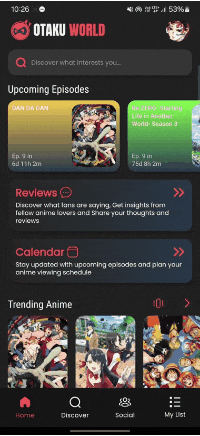
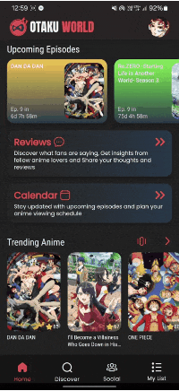
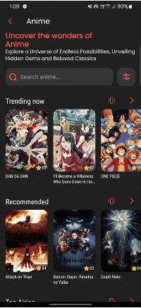
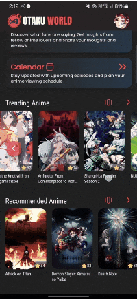
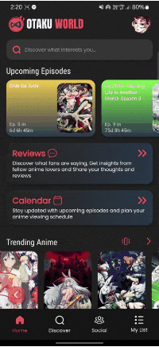
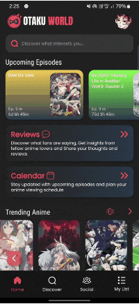

# Otaku World

This [Flutter](https://flutter.dev/)-based mobile app brings [AniList](https://anilist.co/) to your pocket. It enables anime and manga enthusiasts to browse a vast library of titles, effortlessly update their watching and reading lists, and connect with fellow fans.

## Built using

The app is built using Flutter and the [AniList API](https://docs.anilist.co/), which is powered by [GraphQL](https://graphql.org/).

## Features

- [x] [**Home** - Gateway to World of Anime & Manga](#home)
- [x] [**Search** - Anime, Manga, Characters, Staff & Studios](#search)
- [x] [**Reviews** - Anime & Manga reviews by Fans](#reviews)
- [x] [**Calendar** - Anime airing schedule, Plan your next watch](#calendar)
- [x] [**Discover** - Explore anime, manga, characters and more to their fullest](#discover)
- [x] [**Anime & Manga Details** - Get all the details, stats, reviews, activities, etc. in one place](#anime--manga-details)
- [x] [**Social** - Connect with fellow Otakus and share your activities](#social)
- [ ] [**My List** - Keep track of your anime watching and manga reading progress](#my-list)
- [x] [**Profile** - Personalized analytics of your activity, keep favorites and more](#profile)

  ### Home
    Your gateway to the anime world. Track upcoming episodes of popular series, browse trending anime and manga, and get personalized recommendations all in one place. Easily stay updated and discover new content that matches your interests.
    

      
    

  ### Search
    Find exactly what you're looking for with our powerful search feature. Look up anime, manga, characters, staff, and studios directly. This versatile tool helps you quickly access information on your favorite shows, creators, and more.
    

      
    

  ### Reviews
    Read fan-written reviews of anime and manga to help you decide what to watch or read next. Share your thoughts too by writing your own reviews. This feature lets you both benefit from others' opinions and contribute to the community.
    

      
    

  ### Calendar
    Keep track of upcoming anime episodes with a daily or weekly schedule. Filter by date to see which shows are airing and never miss a release.
    

      
    

  ### Discover
    Explore a vast collection of anime, manga, characters, staff, and studios. Use powerful filters and search tools to find exactly what interests you and uncover new favorites easily.
    

      
      &nbsp;&nbsp;&nbsp;
      
    

  ### Anime & Manga Details
    Access all the essential information about anime, manga, characters, staff, and studios in one place. View titles, stats, trailers, related media, and more with a well-organized layout that keeps everything at your fingertips.
    

      
    

  ### Social
    Stay connected with fellow anime fans by viewing their activities, including what they’re watching or reading, status updates, and messages. Browse both global and following feeds to stay engaged with the community.
    

      
    

  ### My List
    Easily track your anime watching and manga reading progress with various tracking options. Stay organized by marking what you’ve completed, paused, or plan to watch, ensuring you never lose track of your progress.

  ### Profile
    View and manage your personal profile with ease. Access user stats, favorites, reviews, and social features like followers and followings. Stay engaged by tracking your activity and exploring in-depth insights about your interactions and interests.
    

      
    

